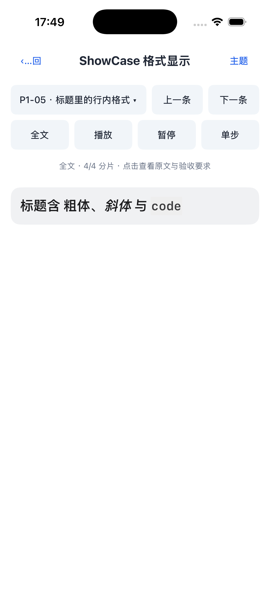
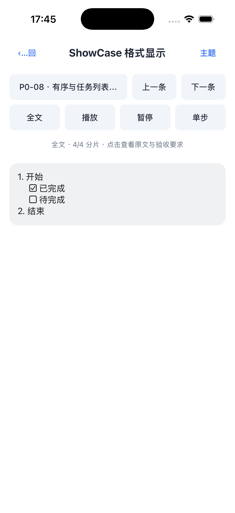
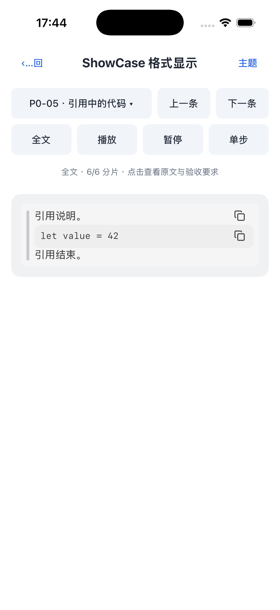
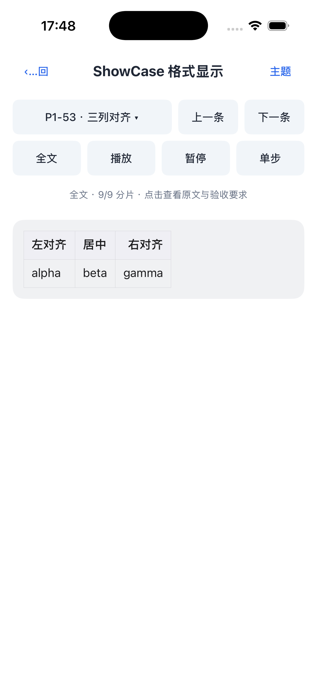
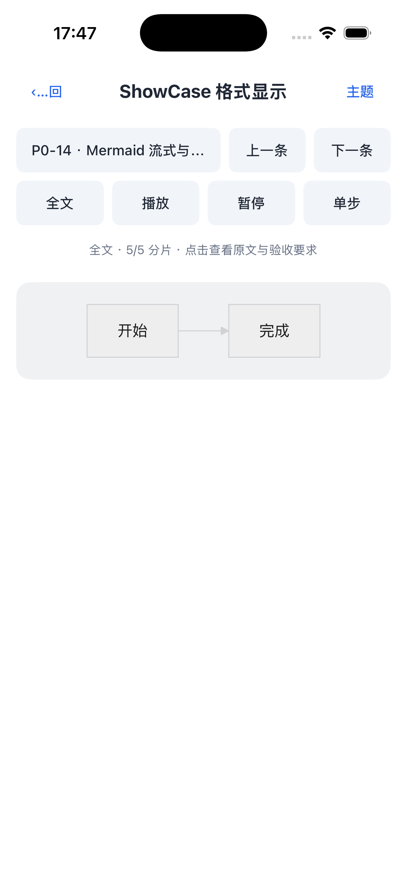
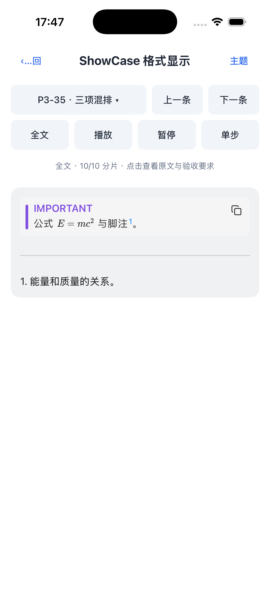
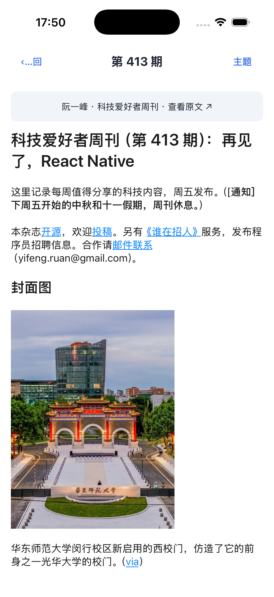
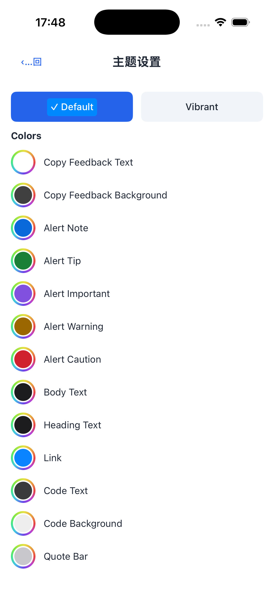
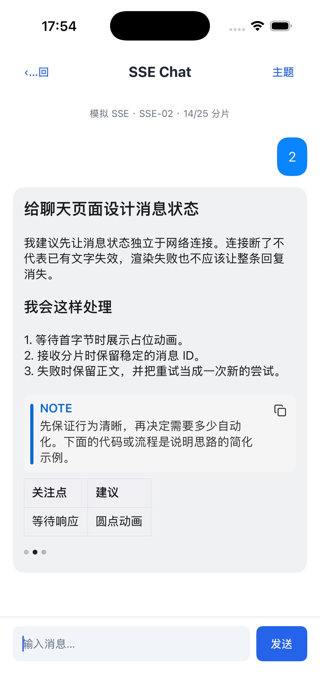
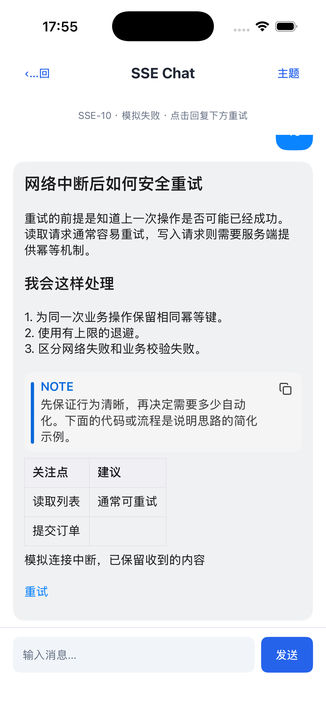

# THKMDView

[English](README.md) · [简体中文](README.zh-CN.md)

A native Markdown view for Android and iOS, designed for AI responses, streaming chat, and article reading.

Text uses native layout. Tables scroll horizontally. Mermaid diagrams and math use bundled, offline WebView/WebKit resources rather than rendering the entire document as a web page.

THKMDView handles rendering—not networking. Your app owns SSE connections, authentication, message storage, navigation, and retry policy.

## Contents

- [Screenshots](#screenshots)
- [Installation](#installation)
- [Quick start](#quick-start)
- [Streaming and SSE](#streaming-and-sse)
- [Themes](#themes)
- [Links, images, and copy actions](#links-images-and-copy-actions)
- [Image loading and caching](#image-loading-and-caching)
- [Math cache](#math-cache)
- [Reuse and lifecycle](#reuse-and-lifecycle)
- [Error handling](#error-handling)
- [Supported Markdown and limitations](#supported-markdown-and-limitations)
- [Integration checklist](#integration-checklist)
- [Examples and support](#examples-and-support)

## Screenshots

Captured from the iOS example app. Click an image to view it at full size.

<table>
  <tr>
    <td align="center"><strong>Headings & inline formatting</strong><br><a href="docs/screenshots/ios/typography.png"></a></td>
    <td align="center"><strong>Ordered & task lists</strong><br><a href="docs/screenshots/ios/lists.png"></a></td>
  </tr>
  <tr>
    <td align="center"><strong>Nested quotes, code & copy buttons</strong><br><a href="docs/screenshots/ios/quotes-code.png"></a></td>
    <td align="center"><strong>GFM tables & column alignment</strong><br><a href="docs/screenshots/ios/tables.png"></a></td>
  </tr>
  <tr>
    <td align="center"><strong>Mermaid diagrams</strong><br><a href="docs/screenshots/ios/mermaid.png"></a></td>
    <td align="center"><strong>Math, alerts & footnotes</strong><br><a href="docs/screenshots/ios/math-alerts-footnotes.png"></a></td>
  </tr>
  <tr>
    <td align="center"><strong>Images, links & long articles</strong><br><a href="docs/screenshots/ios/article-images.png"></a></td>
    <td align="center"><strong>Theme configuration</strong><br><a href="docs/screenshots/ios/themes.png"></a></td>
  </tr>
  <tr>
    <td align="center"><strong>SSE streaming & typing indicator</strong><br><a href="docs/screenshots/ios/sse-streaming.png"></a></td>
    <td align="center"><strong>Failure state & retry</strong><br><a href="docs/screenshots/ios/sse-failure.png"></a></td>
  </tr>
</table>

Article content shown in the screenshot is from [Ruan Yifeng’s Weekly](https://github.com/ruanyf/weekly); it retains its original licensing.

## Installation

Release version: **1.0.3**. Maven and CocoaPods artifacts are available after the release workflows complete.

### Android

Requires Android API 21+. Add the repository to `settings.gradle.kts`:

```kotlin
dependencyResolutionManagement {
    repositories {
        google()
        mavenCentral()
        maven {
            url = uri("https://raw.githubusercontent.com/vizoss/THK-Markdown/maven-repo/")
            content { includeGroup("com.thk.mdview") }
        }
    }
}
```

Add the dependency to your module's `build.gradle.kts`:

```kotlin
dependencies {
    implementation("com.thk.mdview:thkmdview:1.0.3")
}
```

No credentials are required. Put the repository in `dependencyResolutionManagement.repositories`, not `buildscript.repositories`.

#### R8 / ProGuard

Consumer rules are bundled with the library from **1.0.2**; no manual THKMDView rules are required.

### iOS

Requires iOS 13+. Choose one integration method.

#### Swift Package Manager

Requires Xcode 26+ / Swift 6.2+. In Xcode, choose **File → Add Package Dependencies**, enter `https://github.com/vizoss/THK-Markdown.git`, select **Branch → main**, and add the **THKMDView** product to your app target. SPM builds the library from source; examples and tests are not included.

Use a branch or commit requirement, not a version requirement; the parser is pinned to a commit.

#### CocoaPods

Add the precompiled library to your `Podfile`:

```ruby
platform :ios, '13.0'

target 'YourApp' do
  pod 'THKMDView',
      :podspec => 'https://raw.githubusercontent.com/vizoss/THK-Markdown/1.0.3/THKMDView.podspec'
end
```

Run `pod install` and open the `.xcworkspace`. Do not install both the SPM and CocoaPods versions in the same target.

## Quick start

### Android

```kotlin
import com.thk.mdview.THKMDView

val markdownView = THKMDView(context).apply {
    layoutParams = android.widget.LinearLayout.LayoutParams(
        android.view.ViewGroup.LayoutParams.MATCH_PARENT,
        android.view.ViewGroup.LayoutParams.WRAP_CONTENT
    )
    setMarkdown("# Hello\n\nThis is **Markdown**.")
}
container.addView(markdownView) // Your LinearLayout
```

Or declare the view in XML:

```xml
<com.thk.mdview.THKMDView
    android:id="@+id/markdownView"
    android:layout_width="match_parent"
    android:layout_height="wrap_content" />
```

THKMDView is a LinearLayout, **not a TextView**. Configure fonts and colors through theme, not TextView XML attributes. Use maxContentWidthPx for a width cap; its unit is pixels, and a nonpositive value disables the cap.

### iOS

```swift
import UIKit
import THKMDView

let markdownView = THKMDView()
markdownView.translatesAutoresizingMaskIntoConstraints = false
view.addSubview(markdownView)

NSLayoutConstraint.activate([
    markdownView.leadingAnchor.constraint(equalTo: view.safeAreaLayoutGuide.leadingAnchor, constant: 16),
    markdownView.trailingAnchor.constraint(equalTo: view.safeAreaLayoutGuide.trailingAnchor, constant: -16),
    markdownView.topAnchor.constraint(equalTo: view.safeAreaLayoutGuide.topAnchor, constant: 16)
])
markdownView.setMarkdown("# Hello\n\nThis is **Markdown**.")
```

This is a short-content example. For long content, use a UIScrollView and constrain the Markdown view to its contentLayoutGuide with a width matching its frameLayoutGuide.

### Layout and updates

| API | Purpose |
| --- | --- |
| setMarkdown | Replace the complete content and render immediately |
| appendMarkdownChunk | Append only newly received text; updates are debounced |
| reset | Clear content, pending work, attachments, and SSE state |
| theme | Apply styling and rerender existing content |
| imageLoader | Inject an image service before setting content |

Call all view APIs on the **main thread**. The component does not provide document-level vertical scrolling; use your app's scroll view or message list.

Images, diagrams, math, and theme changes can change content height. On iOS, use onContentSizeChange to coalesce list row-height updates. Avoid recursively setting Markdown inside this callback. Your app controls scroll-following and preserves the reader's position.

## Streaming and SSE

Enable the optional status UI and send decoded text deltas—not raw SSE data lines, JSON, or the accumulated response:

```swift
markdownView.sseEnabled = true
markdownView.setSSEState(.waiting)
markdownView.appendMarkdownChunk("Let's break this down")
markdownView.appendMarkdownChunk(" into three steps.")
markdownView.setSSEState(.completed)
```

```kotlin
import com.thk.mdview.THKSSEState

markdownView.sseEnabled = true
markdownView.setSSEState(THKSSEState.WAITING)
markdownView.appendMarkdownChunk("Let's break this down")
markdownView.appendMarkdownChunk(" into three steps.")
markdownView.setSSEState(THKSSEState.COMPLETED)
```

| iOS / Android state | Default presentation |
| --- | --- |
| idle / IDLE | Hidden |
| waiting / WAITING | Three pulsing dots |
| streaming / STREAMING | Three pulsing dots below the content |
| completed / COMPLETED | Flush pending text; hide dots; keep content |
| stopped / STOPPED | Flush pending text; hide dots; keep content |
| failed / FAILED | Flush pending text; keep content; show an error and optional retry button |

A nonempty delta transitions waiting to streaming. Your app must explicitly report completion, cancellation, or failure. A state change does not cancel your network connection.

```swift
markdownView.onRetry = { [weak self] in self?.retryCurrentMessage() }
markdownView.setSSEState(.failed, errorMessage: "Connection interrupted. Your partial response is preserved.")
```

```kotlin
markdownView.onRetry = { retryCurrentMessage() }
markdownView.setSSEState(THKSSEState.FAILED, "Connection interrupted. Your partial response is preserved.")
```

retryCurrentMessage is an app-defined method. Decide whether retry resumes or starts over; use message/request IDs to discard callbacks from previous attempts.

### Customize the indicator

- sseEnabled defaults to false.
- sseStatusUIEnabled = false hides the entire built-in status area, including errors.
- sseIndicatorView accepts your UIView/View; nil/null restores the three dots.
- onSSEIndicatorActivityChanged reports animation start/stop; onSSEStateChanged reports state changes.
- Install callbacks before enabling a busy state. Custom views need a measurable height and must not already belong to another parent.
- Stop custom work when inactive. For views still attached but clipped offscreen, let your host control visibility.

```swift
markdownView.sseIndicatorStyle = THKSSEIndicatorStyle(
    color: .systemBlue, diameter: 6, gap: 5, cycleDuration: 0.9
)
markdownView.onSSEIndicatorActivityChanged = { [weak customIndicator] _, active in
    customIndicator?.setAnimating(active) // Your custom view's method
}
markdownView.sseIndicatorView = customIndicator
```

```kotlin
import com.thk.mdview.THKSSEIndicatorStyle

markdownView.sseIndicatorStyle = THKSSEIndicatorStyle(
    color = android.graphics.Color.BLUE, diameterDp = 6f, gapDp = 5f, cycleMs = 900
)
markdownView.onSSEIndicatorActivityChanged = { _, active ->
    customIndicator.setAnimating(active) // Your custom view's method
}
markdownView.sseIndicatorView = customIndicator
```

Default debounce: 32 ms (streamingDebounceInterval = 0.032 on iOS; streamingDebounceMs = 32 on Android). Continuous input can postpone a debounced refresh; always send a terminal state to flush the final text. Appending deltas is not a fixed-speed typewriter—schedule characters in your app if needed.

See the [SSE contract](docs/sse.md) for detailed behavior.

## Themes

Copy the default theme and change only what your app needs:

```swift
var theme = THKMDTheme.default
theme.bodyFontSize = 17
theme.headingTextColor = .systemBlue
theme.backgroundColor = .clear
theme.copyFeedbackBackgroundColor = UIColor.black.withAlphaComponent(0.8)
markdownView.theme = theme
```

```kotlin
import com.thk.mdview.THKMDTheme

markdownView.theme = THKMDTheme.Default.copy(
    bodyFontSizeSp = 17f,
    headingTextColor = 0xFF2563EB.toInt(),
    backgroundColor = android.graphics.Color.TRANSPARENT,
    copyFeedbackBackgroundColor = 0xCC000000.toInt()
)
```

Names are shared unless listed as Android / iOS. Colors are ARGB Int / UIColor.

| Property | Purpose / default |
| --- | --- |
| bodyTextColor | Body text, lists, table body |
| headingTextColor | Headings and table headers |
| linkColor | Links, footnote numbers, default retry button |
| backgroundColor | Component background; transparent |
| bodyFontSizeSp / bodyFontSize | Body font; 15 sp / pt |
| codeFontSizeSp / codeFontSize | Code font; 13 sp / pt |
| heading1Scale … heading6Scale | Body-size multipliers: 1.6, 1.4, 1.25, 1.15, 1.05, 1.0 |
| codeTextColor / codeBackgroundColor | Inline/block code; copy icons use code text color |
| codeBlockCornerRadiusDp / codeBlockCornerRadius | Code and quote background radius; 8 dp / pt |
| blockQuoteBarColor | Quote bars and thematic breaks |
| blockQuoteTextColor | Quote text, preserving link/code colors |
| blockQuoteBackgroundColor | Outermost quote background |
| tableBorderColor / tableHeaderBackgroundColor | Table borders and header fill |
| imagePlaceholderColor | Loading/failed image placeholder |
| alertNoteColor / alertTipColor / alertImportantColor / alertWarningColor / alertCautionColor | Alert heading and bar; body/background use quote colors |
| footnoteScale / mathScale | Footnote marker / math size multipliers; 0.75 / 1 |
| listBulletScale | Android only: bullet diameter/body font ratio; 0.20 |
| copyFeedbackTextColor / copyFeedbackBackgroundColor | Copy confirmation; white on 75%-opaque black |
| copyFeedbackFontSizeSp / copyFeedbackFontSize | Copy confirmation font; 12 sp / pt |

Mermaid reuses the text, code, table, and quote colors. SSE indicator styling is configured separately through sseIndicatorStyle.

The default theme does not automatically switch to dark mode. Assign an appropriate theme when your app's appearance changes. Android sp follows system font scaling; iOS point sizes require your app's Dynamic Type policy. Theme persistence belongs to your app; the example demonstrates local storage.

## Links, images, and copy actions

**Callback return values differ between platforms.**

| Platform | When your app handles the tap |
| --- | --- |
| iOS onLinkTap / onImageTap | Return false to suppress default interaction |
| Android onLinkClick / onImageClick | Return true; false does not automatically open a browser |

```swift
markdownView.onLinkTap = { [weak self] url in
    self?.routeAllowedURL(url)
    return false
}
markdownView.onImageTap = { [weak self] url in
    self?.presentImage(url)
    return false
}
```

```kotlin
markdownView.onLinkClick = { url -> routeAllowedURL(url); true }
markdownView.onImageClick = { url -> presentImage(url); true }
```

These routing functions belong to your app. Validate schemes and destinations before opening URLs. Set both callbacks explicitly: Android images fall back to the link handler; iOS text and table images have different default behavior. There is no shared baseURL property; resolve relative links/images before rendering or in your loader.

Code blocks and outermost quotes have copy buttons. Copy feedback appears near the button and uses the theme properties above. Formulas are copied as TeX. There is no public copy-success callback or built-in whole-message action bar. Android may also show its system clipboard notification.

## Image loading and caching

### Default loaders

| Behavior | Android | iOS |
| --- | --- | --- |
| Implementation | DefaultTHKImageLoader | DefaultTHKImageLoader |
| Network | HttpURLConnection | URLSession |
| Memory | LruCache, default approximately 1/8 of JVM max heap | NSCache, no public fixed capacity setting |
| Disk | cacheDir/thkmdview_image_cache | Caches/THKMDView/ImageCache |
| Cache key | SHA-256 of URL string | SHA-256 of URL string |
| Constructor options | memoryCacheBytes, diskCacheDir, fetcher | URLSession |

The default disk caches have **no library-managed capacity eviction or TTL**. They do not isolate accounts. Identical URLs may return stale images. For production, inject your existing image service to manage memory, disk limits, authentication, account isolation, and clearing.

### Configure the Android default loader

```kotlin
import com.thk.mdview.DefaultTHKImageLoader

val sharedLoader = DefaultTHKImageLoader(
    context = applicationContext,
    memoryCacheBytes = 16 * 1024 * 1024,
    diskCacheDir = java.io.File(applicationContext.cacheDir, "chat_images")
)
markdownView.imageLoader = sharedLoader
```

memoryCacheBytes must be positive. To disable image caching entirely, supply your own loader. Sharing one loader avoids one memory cache per message view.

### Connect your image service

```kotlin
import android.graphics.Bitmap
import com.thk.mdview.THKImageLoader
import kotlinx.coroutines.CancellationException

class AppImageLoader(
    private val fetch: suspend (String) -> Bitmap?
) : THKImageLoader {
    override suspend fun load(url: String): Bitmap? = try {
        fetch(url)
    } catch (cancelled: CancellationException) {
        throw cancelled
    } catch (_: Exception) {
        null
    }
}
```

```swift
import UIKit
import THKMDView

struct AppImageLoader: THKImageLoading {
    let fetch: (URL) async -> UIImage?
    func load(url: URL) async -> UIImage? {
        await fetch(url)
    }
}
```

Connect fetch to your image framework and assign the adapter to imageLoader before setting content.

- Return nil/null on failure; honor cancellation and cancel underlying work.
- Keep network, disk, and heavy decoding off the UI thread; bound concurrency, response sizes, and decoded dimensions.
- Include account/authorization context in cache keys where required. Clear private caches on sign-out.
- Changing iOS URLSession.URLCache does not disable the loader's separate disk cache.
- Swapping loaders does not clear existing caches. Reset/rebind content when you need a fresh request.
- Completed images can change layout height. Math output does not use your imageLoader.
- Animated images, SVG, and other specialized formats need app-level adaptation and testing.

## Math cache

Math results use a separate process-wide cache, default 8 MiB. Configure it on the main thread:

```swift
THKMDView.configureMathCache(maxBytes: 16 * 1024 * 1024)
THKMDView.clearMathCache()
```

```kotlin
THKMDView.configureMathCache(maxBytes = 16 * 1024 * 1024)
THKMDView.clearMathCache()
```

Zero disables result caching; negative budgets are invalid. Changing the budget clears cached results. Clearing does not stop in-flight rendering or destroy the engine. NSCache limits on iOS are advisory, not a total-memory guarantee. Identical formula requests may be coalesced.

## Reuse and lifecycle

Keep message content and status in your data model, not only in a reusable view.

```kotlin
// Before binding another message:
holder.markdown.reset()
holder.markdown.setMarkdown(message.content)
holder.markdown.sseEnabled = true
holder.markdown.setSSEState(message.state)

// In onViewRecycled:
holder.markdown.reset()
holder.markdown.onRetry = null
```

```swift
override func prepareForReuse() {
    super.prepareForReuse()
    markdownView.reset()
    markdownView.onRetry = nil
}
```

The holder/message objects above are your own. Rebind callbacks, theme, and state for each message. Cancel app-owned SSE tasks on reuse or page exit, and use weak captures in controller callbacks.

reset cancels internal pending work and tears down old segments. It does not cancel your network connection, erase message history, or clear shared caches. Configuration—including callbacks, theme, loader, and custom indicator—is retained.

## Error handling

Recoverable parser failures first trigger a full parse retry. If that fails too, the component displays the raw text and reports onRenderFailure. Future content updates attempt normal parsing again. A parse error does **not** automatically mark the SSE request as failed.

For custom parsers, Android exposes MarkdownRenderer via setMarkdownRenderer; iOS exposes MarkdownRendering via renderer, with throwing renderSafely/renderFull hooks. Prefer the default renderer unless you need custom parsing behavior.

JVM Errors such as OOM, Swift traps, Objective-C exceptions, and native crashes are outside this recovery contract. Do not call setMarkdown unconditionally from the error callback.

## Supported Markdown and limitations

Supported: headings, emphasis, strikethrough, links, lists, task-list display, quotes, fenced/indented code, GFM tables, asynchronous images, Mermaid, NOTE/TIP/IMPORTANT/WARNING/CAUTION alerts, basic footnotes, and inline/block math.

- Code uses a monospace font and theme background; syntax highlighting is not supported.
- Top-level tables have independent horizontal scrolling. Tables inside lists/quotes fall back to text.
- Top-level Mermaid fences render diagrams; nested fences remain code.
- Math supports the bundled MathJax base/AMS subset, not arbitrary LaTeX documents.
- Basic footnotes do not provide navigation/backlinks, recursive definitions, or cross-message references.
- Task checkboxes are display-only.
- Raw HTML is displayed as text rather than executed.
- Incremental parsing can fall back to a full parse; long individual containers and preprocessing still have costs.
- Platform fonts and line-breaking differ. Pixel-identical wrapping and justified text are not guaranteed.

## Integration checklist

- Update views on the main thread; append decoded deltas only.
- Report stream completion, stop, and failure explicitly.
- Reject callbacks from old message/request IDs after cancellation.
- Handle asynchronous height changes and preserve the user's scroll position.
- Validate external URLs; use HTTPS and app-appropriate network policies.
- Limit untrusted content size, image dimensions, and concurrent work.
- Define cache retention, account isolation, and sign-out cleanup.
- Preserve bundled Mermaid/MathJax resources and third-party licenses.
- Test narrow screens, large fonts, long responses, reuse, failed images, and interrupted streams.

## Examples and support

The example apps include format showcases, 30 simulated AI replies, a technology-weekly reader, and a persistent theme editor. They are not included in the library.

For development and examples: [Android](android/README.md), [iOS](ios/README.md). For parser/performance details: [performance notes](docs/performance-review.md).

Report issues with your platform, OS/library version, minimal Markdown, chunk sequence, theme, and expected/actual behavior. Please remove private messages, credentials, and personal data from reports.

## License

[MIT](LICENSE). Bundled dependencies retain their own licenses. External articles and images retain their original rights.
